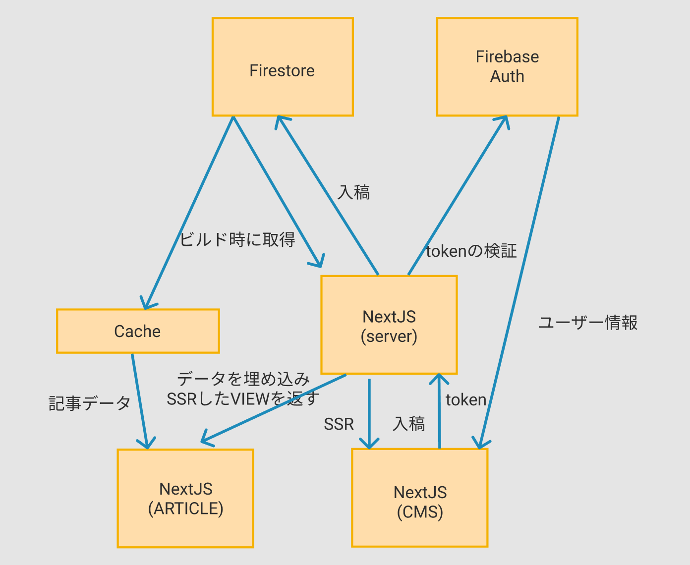

このブログと別にもう一つ別で、[til.ojisan.io](https://til.ojisan.io)というブログ的なものを作ってみました。
これはブログというより、毎日調べたことをメモするために使っています。
（というのは建前で NextJS の ISR で作る題材として作っただけです。）

ISR(Incremental Static Regeneration)は NextJS9.4 で追加された機能で、動的な SSG とキャッシュを駆使したレスポンスをしてくれます。
これは SSG のデメリット（ビルド時間）を削減し、メリットのみを享受できます。

ISR についてはすでに様々な方が触れているので自分が今更触れなくてもいいと思っていたのですが、実際に使ってみた意見などは意外とないことに気づいたので、素振りをしてみた気付きやハマったことを共有したいと思います。

## 成果物の概要

### 何を作ったか

ブログです。
firestore に投稿し、それを ISR で表示させています。
機能としてはブログの表示・タグ機能・そして簡易的な CMS としての入稿編集機能があります。
画像投稿はめんどくさかったのでやっていません。

markdown 入稿にしなかったのは管理画面から入稿できるようにしたかったからです。
Today I Learned の記述は即時やりたく markdown ファイル作るのはめんどうだったからです。
また入稿のエンドポイントがあればそのうち CMS だけを React Native や Electorn に切り出して、もっと気軽に入稿できるシステムにも広げていくという狙いもあります。



### どうやって作ったか

NextJS で作ったブログを Vercel にデプロイしています。
ビルド時に Firestore に対して Firebase Admin 経由でコンテンツを取得し、それを getStaticProps でページに流し込んで描画しています。

データのやりとりは全て Firebase Admin 経由で行っています。
これは firestore のルールを全部禁止にしたかったからです。
これにより僕以外の人が勝手に情報を追加できないようにしています。
ルールを禁止しても Admin 経由であればルールを無視できるので問題ありません。
その Admin 機能はビルド時のデータ取得・投稿を受け取る API Routes で実行されます。

入稿の際は Firebase Auth で認証し、そこで得たトークンをサーバー側で検証して、そのユーザー ID が事前に登録している僕であれば投稿できるという風にしています。

## ISR で作って感じたメリット

### DB の負荷が減った

ISR ではキャッシュ更新のタイミングを指定できます。

```js
export const getStaticProps: GetStaticProps = async () => {
  const postResponse = await getPosts()
  const { data, error } = postResponse

  return {
    props: !error ? { posts: data } : { error },
    revalidate: 600,
  }
}
```

今回はタイムアウトは 10 分にしたのですが、firestore のアクセスログをみてみるとその 10 分の間はアクセスが減ったのを確認できました。
つまりちゃんとキャッシュから返しておりリクエストが firestore まで到達していないことを確認しました。
これまでは課金が怖くて何かを作るときは Firestore を置いていたのですが、RDS などの課金される DB を裏側に置いても問題ないなと思いました。

### ISR/SSR を柔軟に切り替えられるのが嬉しい

コンテンツ側は ISR ですが、管理者画面側は SSR です。
これは管理者画面は getStaticProps ではなく getServerSideProps を使うことで実現しています。
コンテンツ更新後に即座にそのコンテンツを修正できるようにしたいので、管理画面側は SSG していません。
また管理者画面はキャッシュを使った高速化や DB への Read 削減をしなくていいと思っているからです。
ページごとに ISR か SSR かを切り替えられるのはうれしかったです。

### キャッシュのパージも楽

ISR をすると誤ったデータもキャッシュされてしまい、それは自分でコントロールできるのかは懸念に思っていたのですが、Vercel では再ビルドすればキャッシュを消せます。
そしてその再ビルドは Vercel 上のボタンから行えるので楽です。

また再ビルドのトリガーは CMS 側にも用意すればコンテンツ更新も楽になると思います。（ビルドをコントロールするリンクを作れる機能が now にあったので多分今もできるはず。手が回らなくて実装していませんが。）

## ISR で作って感じたデメリット・注意点

と、ISR は使い勝手が良さそうでサービス特性的に ISR を使えるときは使った方が良いと思ったのですが、実際に作り込んでいくといろいろはまり込んだこともありました。

### API Routes との併用でデッドロック

元々の設計は SSG 時のデータアクセスは全て API Routes に定義していた API エンドポイントから行っていました。
このとき、そのビルドで失敗するとデプロイができなかった場合にコードを修正して再デプロイするとして、すでに誤った API がデプロイされていたらそもそものビルドでこけて、修正版をデプロイできなくなるという問題に陥りました。
ビルド時に正しいエンドポイントが先に存在していなければいけないからです。
そのため API Routes 経由でデータを取得するのではなく、SSG 時の関数の中で直接データを取得するようにしました。

### Vercel にロックインされる

ISR は現時点では Vercel に載せているときにのみ使える機能です。
サービスが伸びると脱 Vercel したいというような話もでるとは思いますので、Vercel を採用することによる恩恵は、特定のインフラにロックされるデメリットとして捉えています。
ISR の採用がインフラのロックに繋がることを踏まえると、キャッシュは全て自分たちで管理できる仕組みの方がよいと思い、SSR をキャッシュと併用して使った方が良いかなと思いました。
もちろん SSR を採用してキャッシュに責任を持つことは考慮すべきことも増えるので、それを全部 Vercel に押し付けれる ISR は魅力的で、細かいチューニングを必要としないのであれば ISR を使えばと良いとも思います。
ただ、もし僕に無限の理解力と無限の実装力があったとすれば、そのとき ISR を採用する理由って何だろうという疑問は残っています。

## ソースコード

https://github.com/sadnessOjisan/til.ojisan.io
